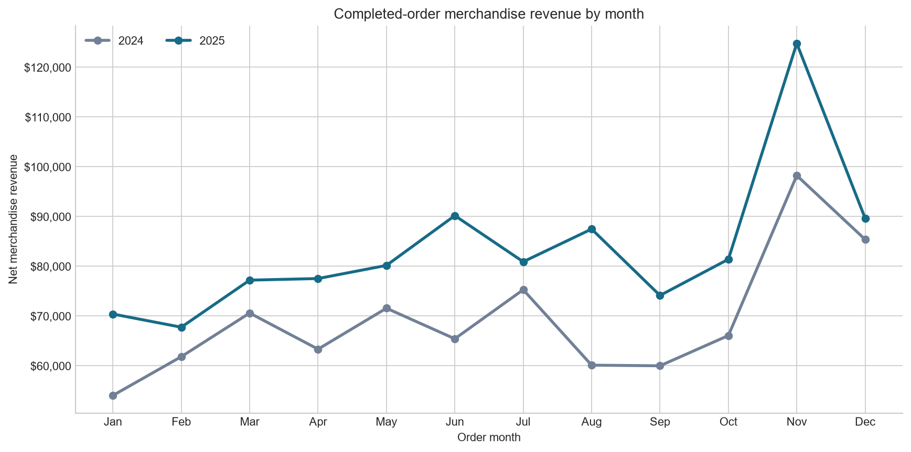
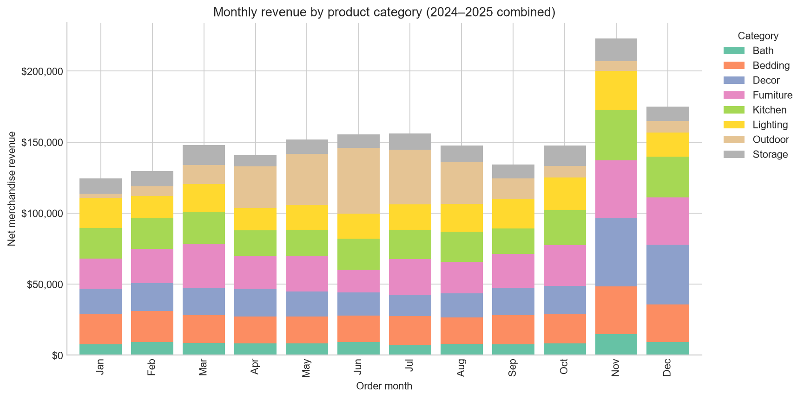
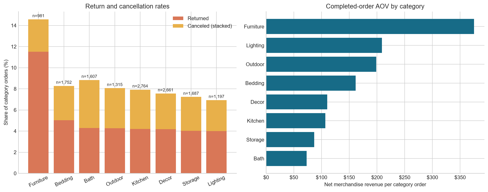
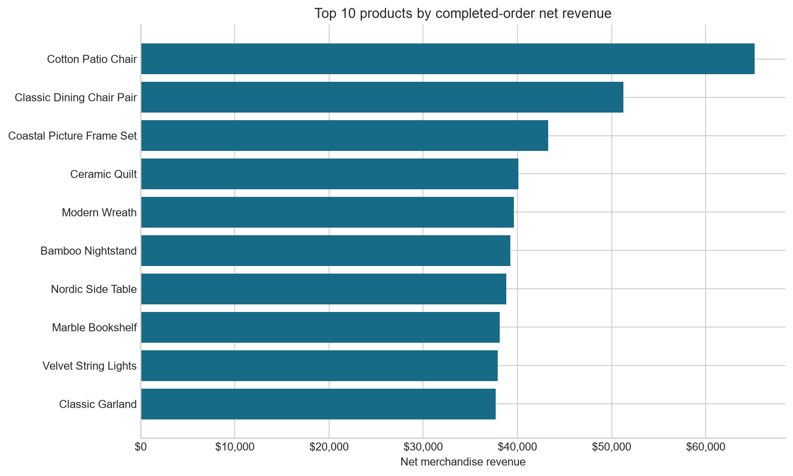

# Wayfare E-commerce Sales Analytics

## Project overview

A two-year e-commerce sales review for the 2024 and 2025 order exports. The project audits and cleans customer, order, order-item, and product data, defines a transparent merchandise-revenue measure, and summarizes sales trends, product/category performance, returns, cancellations, and average order value (AOV). The analysis is intended to support next-year planning; the revenue measure is not a finance-reconciled financial statement.

## Project contents

- `wayfair_sales_review.ipynb` — primary analysis notebook, organized into distinct audit, cleaning, metric-definition, sales-trend, category/product, outcome, visualization, and executive-summary sections.
- `datasets/customers.csv` — customer ID, signup date, state, and acquisition channel.
- `datasets/orders.csv` — order/customer IDs, order timestamp and status, payment method, discount code, and shipping fee.
- `datasets/order_items.csv` — order/product IDs, quantity, unit price, and line discount.
- `datasets/products.csv` — product ID/name, category, list price, and unit cost.
- `wayframe_ecommerce_sales_analytics.ipynb` — additional notebook included with the project.

## Run the analysis

Open `wayfair_sales_review.ipynb` in Jupyter or VS Code and run the cells from top to bottom. The notebook expects the `datasets` folder to be in the current project directory. It uses Python with `pandas`, `numpy`, and `matplotlib` (plus IPython/Jupyter for notebook display).

## Analysis workflow

1. **Audit the raw exports:** report row/column counts, exact duplicates, missing values, label variations, key conflicts, and unmatched relationships before analysis.
2. **Clean with an audit trail:** trim strings, normalize status/payment/channel/category labels, parse dates and numeric fields, remove exact duplicate records, and validate keys and measures. Blank discount codes are normalized to `no_code`. Required missing/invalid item values are not imputed; affected orders are excluded from revenue and AOV to avoid counting partial order totals. The notebook reports each exclusion.
3. **Define revenue:** line net merchandise revenue is `quantity × unit_price − discount_amount`; order revenue is the sum of its lines. Sales include only 2024–2025 orders with `completed` status and complete, valid item detail. Shipping and tax are excluded, and returned/canceled orders are excluded from sales revenue but included in order-outcome reporting.
4. **Analyze performance:** compare monthly revenue year over year and seasonality; rank categories and products; review monthly category mix; compare category-level return and cancellation rates and category AOV.
5. **Communicate decisions:** provide four labeled charts and a one-page summary with three key findings and two planning recommendations.

## Charts

These are exported from the analysis notebook and embedded below. Re-run the chart-export cell after updating the data to refresh the PNGs in `assets/charts/`.

### Monthly revenue comparison

### Monthly revenue by product category

### Category return, cancellation, and AOV comparison

### Top products by revenue

## Headline results

Using the notebook's documented metric and current exports:

- Completed-order merchandise revenue was **$831,807 in 2024** and **$1,001,536 in 2025**, a **20.4% increase**.
- The increase was primarily associated with order growth (**18.1%**); average order value rose **2.0%**.
- **Furniture** was the largest category by two-year revenue (**17.1%**) and had the highest combined category return/cancellation rate in this analysis.
- **November** was the highest-revenue month across the two years. Revenue was higher year over year in each month of 2025; August had the strongest percentage increase.

These results are generated in the notebook and will change if the source files or analysis rules change. Run the notebook to refresh the figures.

## Important data and metric caveats

- The current audit found **38 repeated order records** and **199 order-item rows** with missing or invalid required measures, affecting **197 orders**. The analysis excludes affected orders with incomplete item detail; **174 completed orders** are excluded from sales revenue and AOV as a result.
- Excluding incomplete orders avoids treating missing prices as zero or partial sales, but if missingness is systematic, revenue growth and category shares may be biased.
- The revenue measure is discounted merchandise value on completed orders, **not** accounting net revenue after refunds, shipping, or taxes. The source exports do not provide refund amounts or tax detail. Reconcile with the finance ledger before using the figures for formal financial reporting.
- Two years of monthly data can suggest seasonality, but do not establish a robust forecast. Validate inventory and campaign plans against additional history, supply constraints, and current business context.